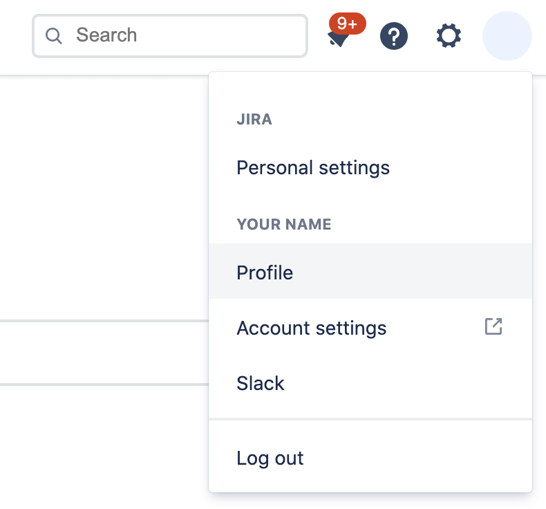

# Jiralog
JiraLog allows you to track time on Jira with CLI

## Installation

Download all dependencies with

    composer install

After composer has finished downloading all the dependencies, give execution permissions to `jiralog` file in root directory:

    chmod +x jiralog

Create a symlink to the jiralog script in a shared path, for example

     sudo ln -s /path/to/jiralog-project/jiralog /usr/local/bin/jiralog

Copy the `.env.example` file into `.env`.

Then, customize `.env` with your data.

- TEMPO_ENDPOINT: https://api.tempo.io/

   **Note:** This version supports only [Tempo.io](https://www.tempo.io/) in cloud
- TOKEN : [create the new api integration in your tempo.io app](https://help.tempo.io/cloud/en/tempo-timesheets/developing-with-tempo/using-rest-api-integrations.html) on jira and copy the token
- AUTHOR_ACCOUNT_ID : you can copy it by the url of your jira profile
  

## Available commands

### Tempo
Log a new worklog on tempo.io

     jiralog tempo:log <date> <from> <to> <issue> [<comment>]

example

    jiralog tempo:log 2021-08-25 1330 1400 TASK-73 "Comment"

## Tests

    vendor/bin/phpunit

## Sources
This app is inspired by [Redlog](https://github.com/aleron75/redlog), a repo of [Aleron75](https://github.com/aleron75)

## License
Refer to [LICENSE](LICENSE) file for details.